# Tidytuesday

Code and plots of the submissions to the [#tidytuesday](https://github.com/rfordatascience/tidytuesday) challenge 

## Highlights (click on image to go to code):  

### [2021 - Week 42](2021_w42) Global Seafood by [OurWorldinData.org](https://ourworldindata.org/seafood-production)

___

### [2021 - Week 41](2021_w41) Registered Nurses by [Data.World](https://data.world/zendoll27/registered-nursing-labor-stats-1998-2020)

___

### [2021 - Week 40](2021_w40) NBER Papers by [NBER](https://www.nber.org/)
<a href="2021_w40">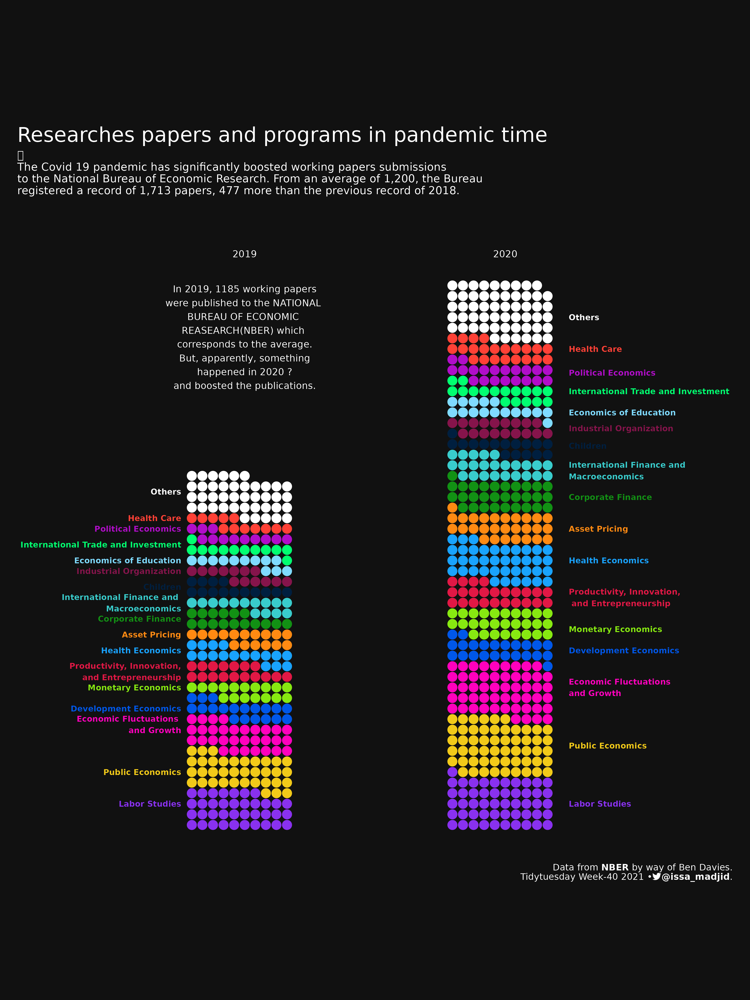</a>
___

### [2021 - Week 38](2021_w38) Billboard Top 100 by [Data.World](https://data.world/kcmillersean/billboard-hot-100-1958-2017#)

___

### [2021 - Week 37](2021_w37) Formula 1 Races by [ergast.com/mrd/db](https://ergast.com/mrd/db/)

___

### [2021 - Week 34](2021_w34) Star Trek Voice Commands by [SpeechInteraction.org](http://www.speechinteraction.org/TNG/)

___

### [2021 - Week 33](2021_w33) BEA Infrastructure Investment by [BEA](https://www.bea.gov/system/files/2021-01/infrastructure-data-may-2020.xlsx)
<a href="2021_w33">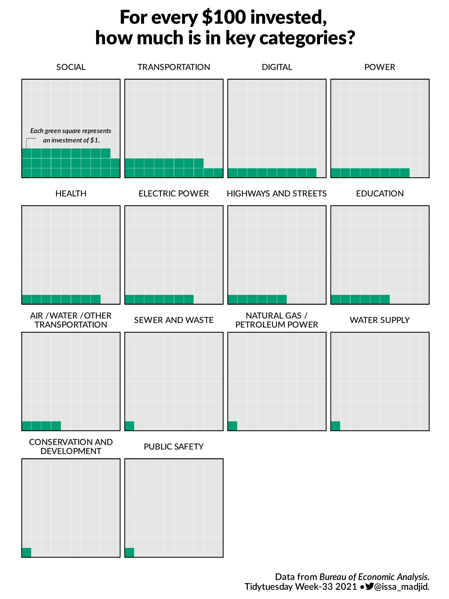</a>
___

### [2021 - Week 32](2021_w32) Paralympics Medals by [IPC](https://db.ipc-services.org/sdms/hira)
<a href="2021_w32">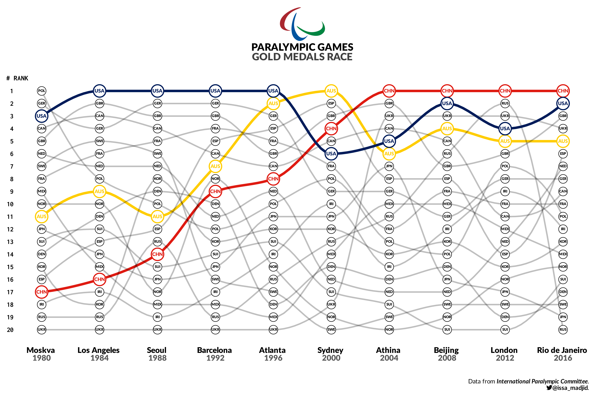</a>
___

### [2021 - Week 31](2021_w31) Olympics Medals by [Kaggle](https://www.kaggle.com/heesoo37/120-years-of-olympic-history-athletes-and-results)
<a href="2021_w31">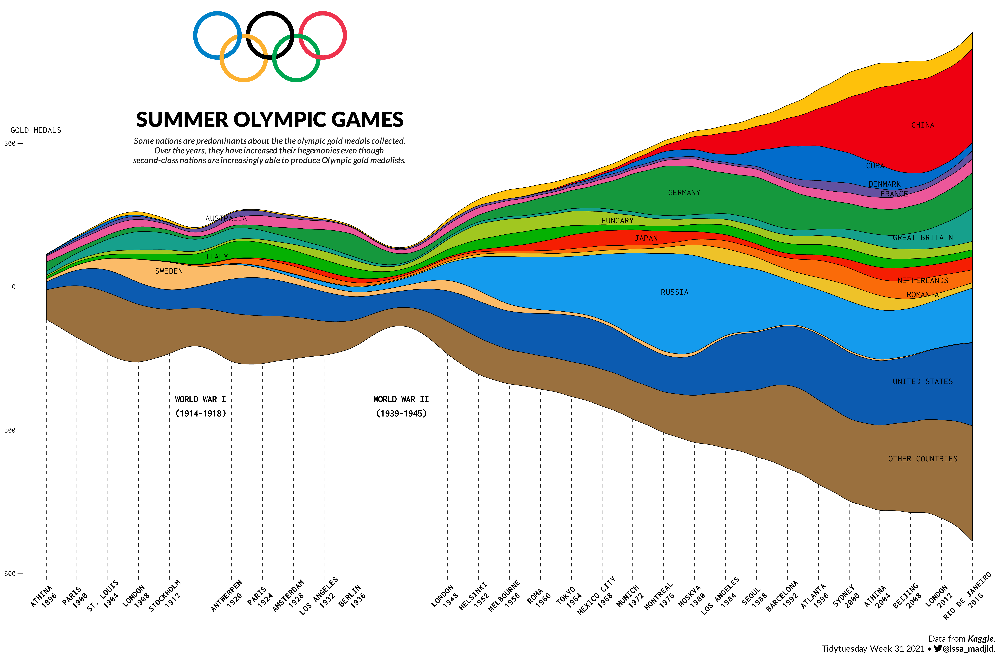</a>
___
	
### [2021 - Week 30](2021_w30) US Droughts by [Drought Monitor](https://droughtmonitor.unl.edu/DmData/DataDownload.aspx)
<a href="2021_w30">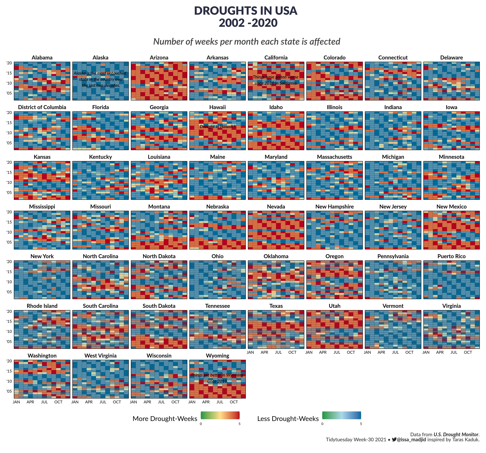</a>
___
	
### [2021 - Week 29](2021_w29) Scooby Doo by  [Kaggle](https://www.kaggle.com/williamschooleman/scoobydoo-complete)

___
	
	
### [2021 - Week 28](2021_w28) International Independence Days by [Wikipedia](https://en.wikipedia.org/wiki/List_of_national_independence_days)
<a href="2021_w28">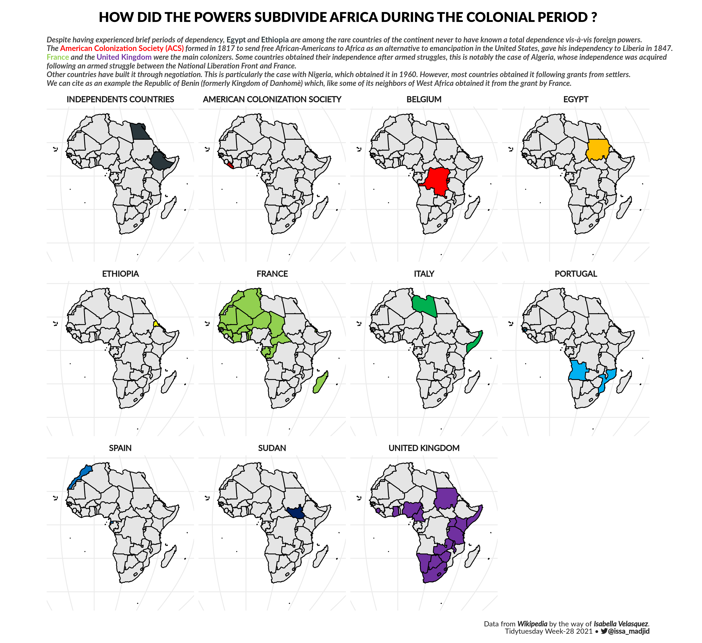</a>
___
	
### [2021 - Week 27](2021_w27) Animal Rescues by [London.gov](https://data.london.gov.uk/dataset/animal-rescue-incidents-attended-by-lfb)
<a href="2021_w27">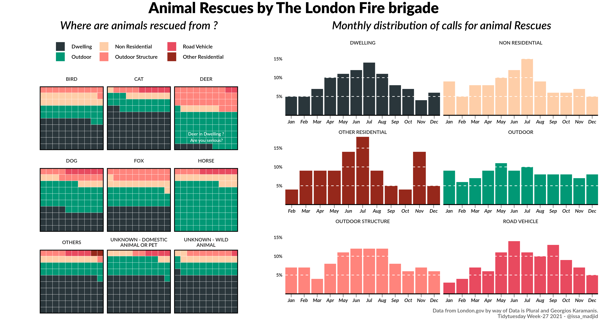</a>
___
	
### [2021 - Week 26](2021_w26) Public Park Access by [TPL](https://www.tpl.org/parks-and-an-equitable-recovery-parkscore-report)
<a href="2021_w26">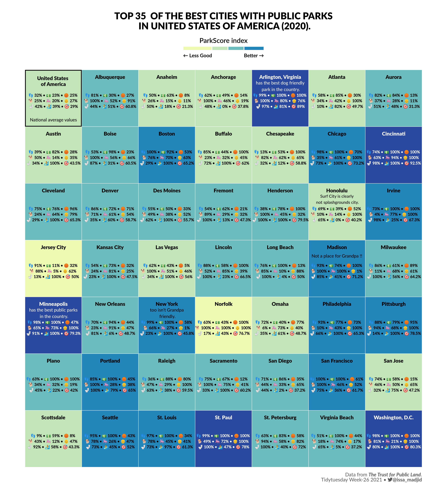</a>
___
	
### [2021 - Week 25](2021_w25) WEB Du Bois and Juneteenth by [`#DuBoisChallenge` tweets](https://public.tableau.com/app/profile/sekou.tyler/viz/DuBoisChalllenge2021TwitterMetrics/DuBoisChallenge2021TwitterActivity)
<a href="2021_w25">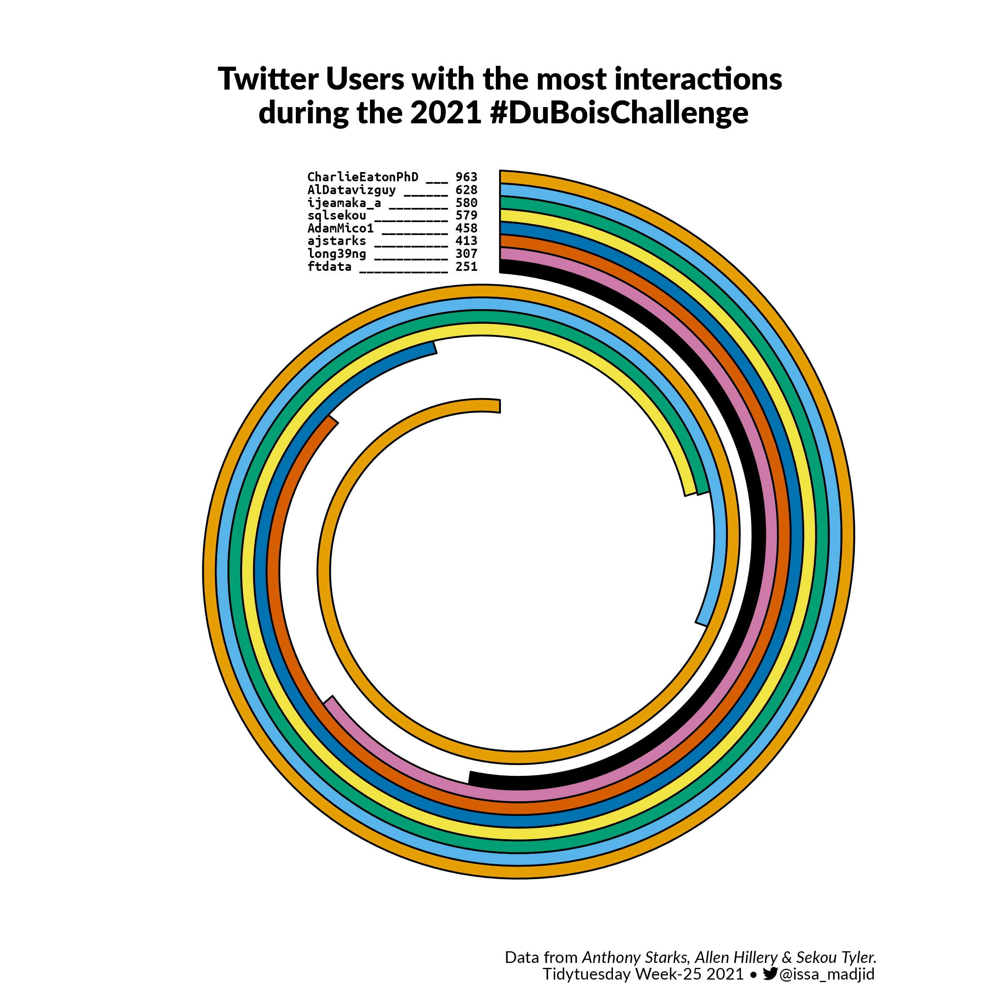</a>
___
	
### [2021 - Week 24](2021_w24) Great Lakes Fish by [Great Lakes Database](http://www.glfc.org/great-lakes-databases.php)

___
	
### [2021 - Week 20](2021_w20) US Broadband by [Microsoft GitHub](https://github.com/microsoft/USBroadbandUsagePercentages)
<a href="2021_w20">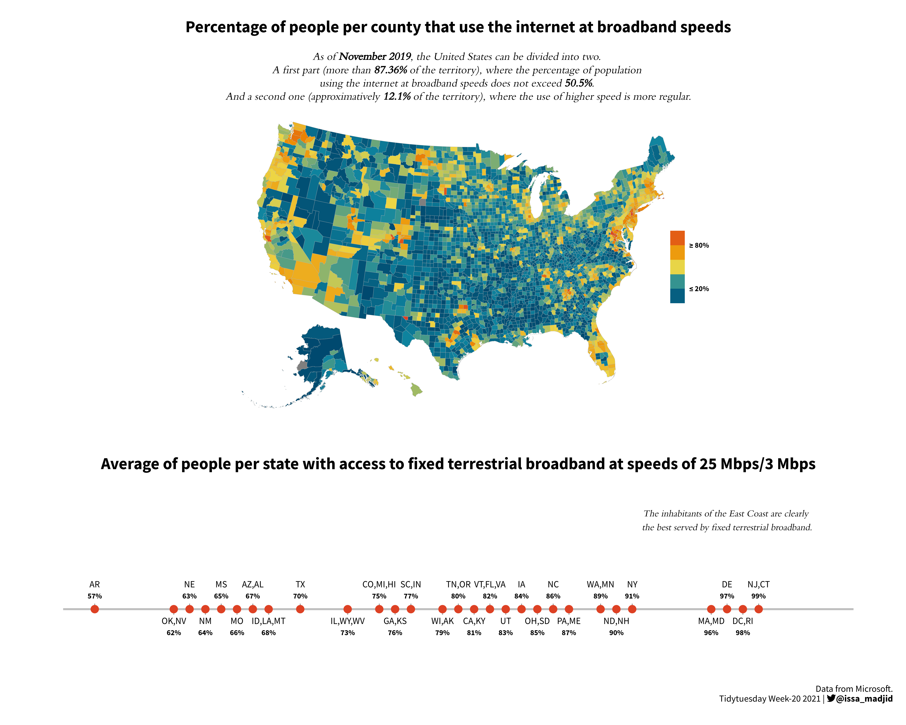</a>
___
	
### [2021 - Week 19](2021_w19) Water Access Points by [WPDX](https://www.waterpointdata.org/)
<a href="2021_w19">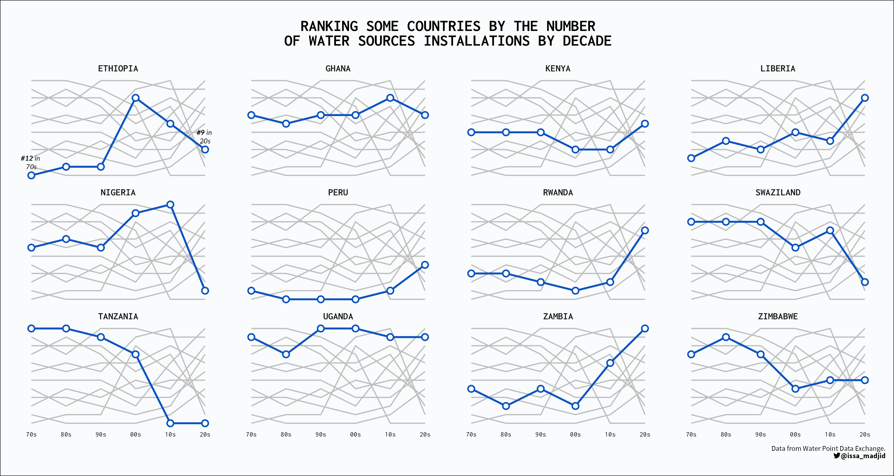</a>
___

