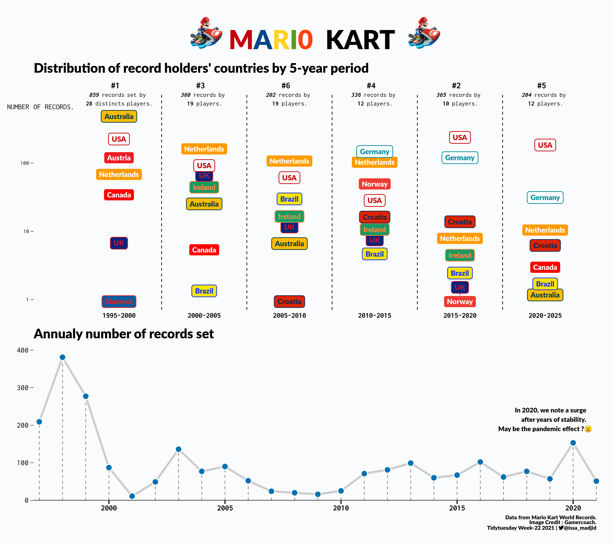
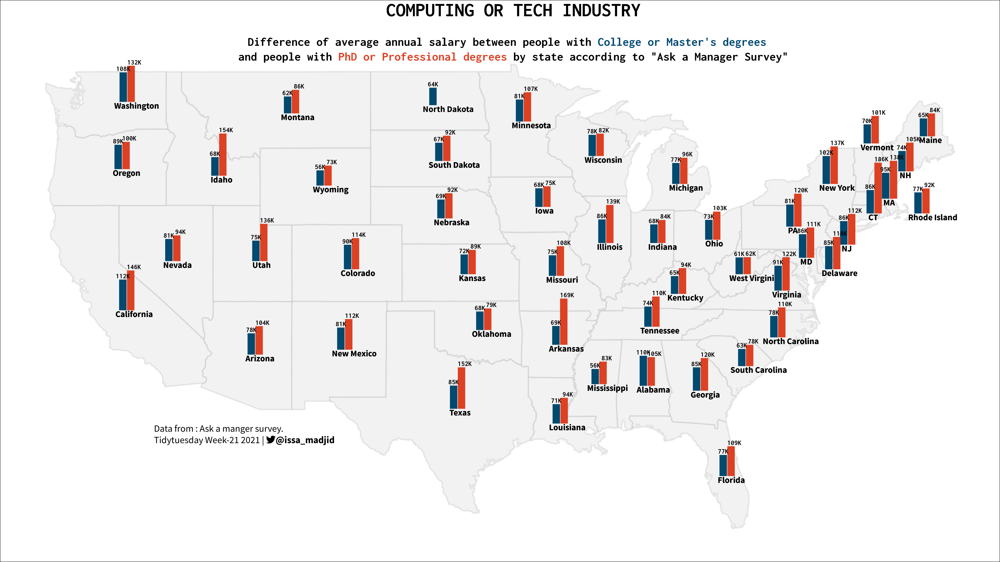
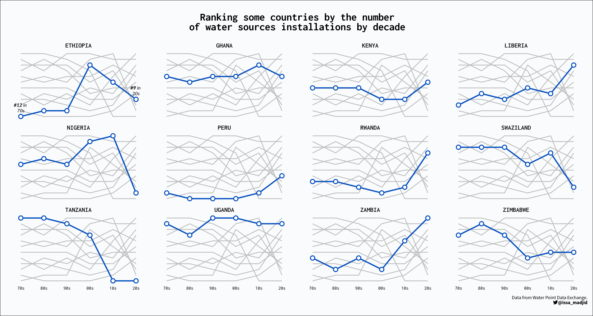

# tidytuesday

Code and plots of the submissions to the [#tidytuesday](https://github.com/rfordatascience/tidytuesday) challenge 

### Highlights (click on image to go to code):  
___

 
  

	
	
	
	
  

