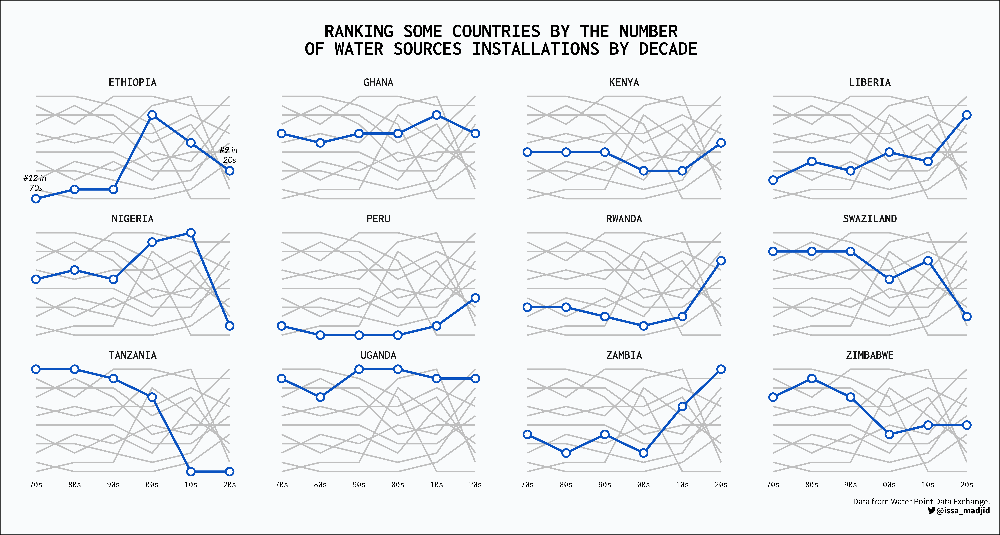

# Tidytuesday

Code and plots of the submissions to the [#tidytuesday](https://github.com/rfordatascience/tidytuesday) challenge 

## Highlights (click on image to go to code):  

### [2022 - Week 34](2022/2022/2022_w34) CHIP dataset by [The CHIP dataset](https://chip-dataset.vercel.app/)
___ 

### [2022 - Week 21](2022/2022_w21) Women's Rugby by [ScrumQueens](https://www.scrumqueens.com/blogs/jbirch/story-behind-our-data-hub)
___ 

### [2022 - Week 12](2022/2022_w12) Baby names by [Hadley Wickham](http://hadley.github.io/babynames/)
___ 

### [2022 - Week 10](2022/2022_w10) Erasmus student mobility by [Data.Europa.eu](https://data.europa.eu/data/datasets/erasmus-mobility-statistics-2014-2019-v2?locale=en)
___ 

### [2022 - Week 9](2022/2022_w9) Alternative Fuel Stations by [US DOT](https://data-usdot.opendata.arcgis.com/datasets/usdot::alternative-fueling-stations/about)
___ 

### [2022 - Week 6](2022/2022_w6) Tuskegee Airmen by [Commemorative Airforce (CAF) by way of the VA-TUG](https://github.com/lang1023/Tuskegee-Airman-Challenge)
___

### [2022 - Week 5](2022/2022_w5) Dog breeds by [American Kennel Club](https://github.com/kkakey/dog_traits_AKC)
___
 
### [2022 - Week 1](2022/2022_w1) Covid-19 in American States in 2021 by [NY Times](https://github.com/nytimes/covid-19-data)
___

### [2021 - Week 52](2021/2021_w52) Starbucks drinks by [Starbucks](https://globalassets.starbucks.com/assets/94fbcc2ab1e24359850fa1870fc988bc.pdf)

___

### [2021 - Week 51](2021/2021_w51) Spice Girls by [Jacquie Tran](https://github.com/jacquietran/spice_girls_data)

___

### [2021 - Week 46](2021/2021_w46) Polio in Africa by [OurWorldInData](https://ourworldindata.org/polio)

___

### [2021 - Week 44](2021/2021_w44) Ultra Trail Running by [Benjamin Nowak](https://github.com/BjnNowak/UltraTrailRunning)

___

### [2021 - Week 43](2021/2021_w43) Big Pumpkins by [BigPumpkins.com](http://www.bigpumpkins.com/ViewArticle.asp?id=132)

___

### [2021 - Week 42](2021/2021_w42) Global Seafood by [OurWorldinData.org](https://ourworldindata.org/seafood-production)

___

### [2021 - Week 41](2021/2021_w41) Registered Nurses by [Data.World](https://data.world/zendoll27/registered-nursing-labor-stats-1998-2020)

___

### [2021 - Week 40](2021/2021_w40) NBER Papers by [NBER](https://www.nber.org/)

___

### [2021 - Week 38](2021/2021_w38) Billboard Top 100 by [Data.World](https://data.world/kcmillersean/billboard-hot-100-1958-2017#)

___

### [2021 - Week 37](2021/2021_w37) Formula 1 Races by [ergast.com/mrd/db](https://ergast.com/mrd/db/)

___

### [2021 - Week 34](2021/2021_w34) Star Trek Voice Commands by [SpeechInteraction.org](http://www.speechinteraction.org/TNG/)

___

### [2021 - Week 33](2021/2021_w33) BEA Infrastructure Investment by [BEA](https://www.bea.gov/system/files/2021-01/infrastructure-data-may-2020.xlsx)

___

### [2021 - Week 32](2021/2021_w32) Paralympics Medals by [IPC](https://db.ipc-services.org/sdms/hira)

___

### [2021 - Week 31](2021/2021_w31) Olympics Medals by [Kaggle](https://www.kaggle.com/heesoo37/120-years-of-olympic-history-athletes-and-results)

___
	
### [2021 - Week 28](2021/2021_w28) International Independence Days by [Wikipedia](https://en.wikipedia.org/wiki/List_of_national_independence_days)

___
	
### [2021 - Week 27](2021/2021_w27) Animal Rescues by [London.gov](https://data.london.gov.uk/dataset/animal-rescue-incidents-attended-by-lfb)

___
	
### [2021 - Week 26](2021/2021_w26) Public Park Access by [TPL](https://www.tpl.org/parks-and-an-equitable-recovery-parkscore-report)

___
	
### [2021 - Week 25](2021/2021_w25) WEB Du Bois and Juneteenth by [`#DuBoisChallenge` tweets](https://public.tableau.com/app/profile/sekou.tyler/viz/DuBoisChalllenge2021TwitterMetrics/DuBoisChallenge2021TwitterActivity)

___
	
### [2021 - Week 24](2021/2021_w24) Great Lakes Fish by [Great Lakes Database](http://www.glfc.org/great-lakes-databases.php)

___
	
### [2021 - Week 20](2021/2021_w20) US Broadband by [Microsoft GitHub](https://github.com/microsoft/USBroadbandUsagePercentages)

___
	
### [2021 - Week 19](2021/2021_w19) Water Access Points by [WPDX](https://www.waterpointdata.org/)

___

