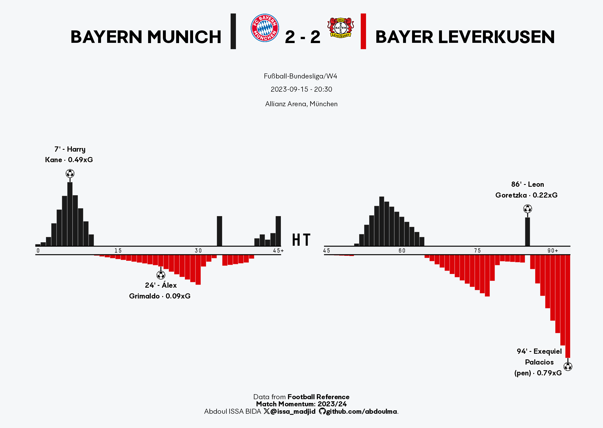

## Examples
___

Edit match `id` in  [script.R](script.R)  to generate yours. 
Example, for the derby delle Madonnina <https://fbref.com/fr/matchs/10a39d69>, the match `id` is `10a39d69`.

### Baryern Munich vs Bayer Leverkusen - Bundesliga W4 2023/24
___

### Internazionale vs Milan - Serie A W4 2023/24
___

 
Barcelona vs Real Betis - Liga W5 2023/24 
___
